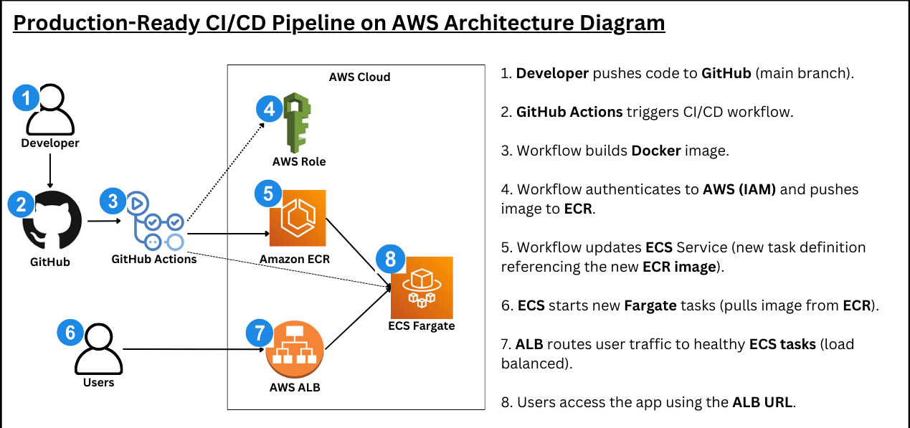
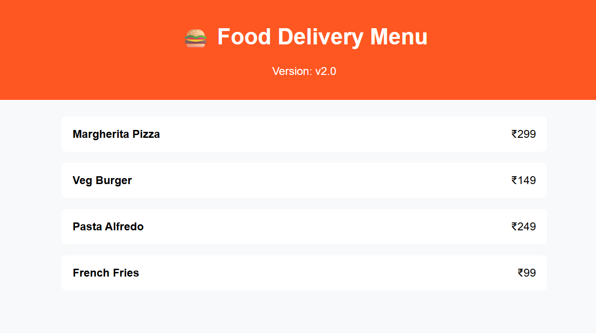

# 🚀 Food Menu Service - CI/CD on AWS

## 📌 Overview

This project demonstrates a **production-ready CI/CD pipeline** using GitHub Actions and AWS services.

A Dockerized Node.js application is automatically built, pushed to Amazon ECR, and deployed to Amazon ECS Fargate on every code push.

---

## ⭐ Key Highlights

* Designed a **production-ready CI/CD pipeline** on AWS
* Automated **build, test, and deployment** using GitHub Actions
* Implemented **containerized deployment** using Docker and Amazon ECS Fargate
* Integrated **Application Load Balancer (ALB)** for high availability
* Achieved **zero-downtime deployment**
* Optimized **cost using on-demand deployment strategy**

---

## 🧠 Core Value Proposition

> Built a fully automated CI/CD pipeline that deploys a containerized application to AWS ECS Fargate with zero manual intervention.

---

## 🏗️ Architecture Overview

This project demonstrates a full CI/CD pipeline using:

GitHub → GitHub Actions → Docker → Amazon ECR → Amazon ECS (Fargate) → ALB → Users

---

## 🏗️ Production Architecture



---
## 📸 Application Preview

Below is the live UI of the deployed application served via AWS ALB:



---

## 🧰 Tech Stack

* **Backend:** Node.js
* **Containerization:** Docker
* **CI/CD:** GitHub Actions
* **Cloud Provider:** AWS

  * Amazon ECR (Container Registry)
  * Amazon ECS (Fargate)
  * Application Load Balancer (ALB)
* **Infrastructure:** AWS Console

---

## ⚙️ CI/CD Pipeline

The deployment pipeline is fully automated:

1. Code is pushed to the `main` branch
2. GitHub Actions workflow is triggered
3. Docker image is built
4. Image is tagged and pushed to Amazon ECR
5. ECS service is updated
6. New container is deployed automatically

---

## 🔄 CI/CD Trigger

The pipeline is triggered automatically by:

* ✅ Push to `main` branch
* ✅ Manual trigger via GitHub Actions (optional)
* ✅ Empty commit (for testing pipeline)

Example:

```
git commit --allow-empty -m "trigger pipeline"
git push
```

---

## 🔐 GitHub Secrets

The following secrets are configured for secure deployment:

* `AWS_ACCESS_KEY_ID`
* `AWS_SECRET_ACCESS_KEY`
* `AWS_ACCOUNT_ID`
* `AWS_REGION`
* `ECR_REPOSITORY`
* `ECS_CLUSTER`
* `ECS_SERVICE`

---

## 🐳 Docker

Build image locally:

```
docker build -t food-menu-service .
```

Run container:

```
docker run -p 3000:3000 food-menu-service
```

---

## ▶️ Run Locally

```
npm install
npm start
```

App will run on:

```
http://localhost:3000
```

---

## ☁️ Deployment

Deployment is handled automatically via GitHub Actions.

Every push to `main` will:

* Build a new Docker image
* Push to ECR
* Trigger ECS deployment

---

## 🌐 Live Application

The application is exposed through an AWS Application Load Balancer (ALB).

Example:

```
http://<your-alb-dns>
```

---

## 🧠 Design Decisions

* Used **ECS Fargate** to avoid managing servers
* Used **ALB** for load balancing and health checks
* Used **ECR** for container image storage
* Used **GitHub Actions** for fully automated CI/CD
* Used **on-demand deployment** to reduce AWS cost

---

## 📈 Key Features

* Fully automated CI/CD pipeline
* Containerized application using Docker
* Serverless container deployment with ECS Fargate
* Scalable and production-ready architecture
* Secure credential management using GitHub Secrets

---

## 🧠 What I Learned

* Building end-to-end CI/CD pipelines
* Integrating GitHub Actions with AWS
* Managing containerized deployments on ECS
* Working with AWS networking and load balancing
* Debugging deployment pipelines and cloud services

---

## 📬 Contact

If you have any questions or feedback, feel free to reach out!

---

⭐ If you find this project helpful, consider giving it a star!
